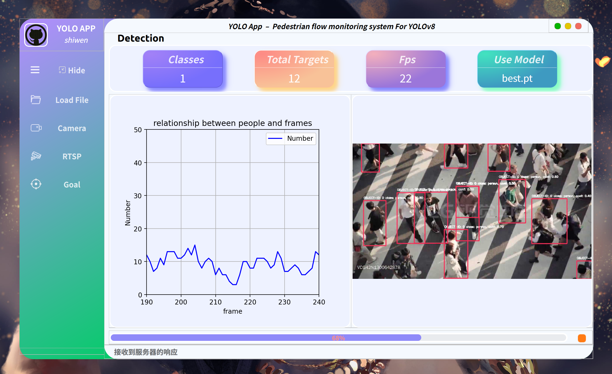
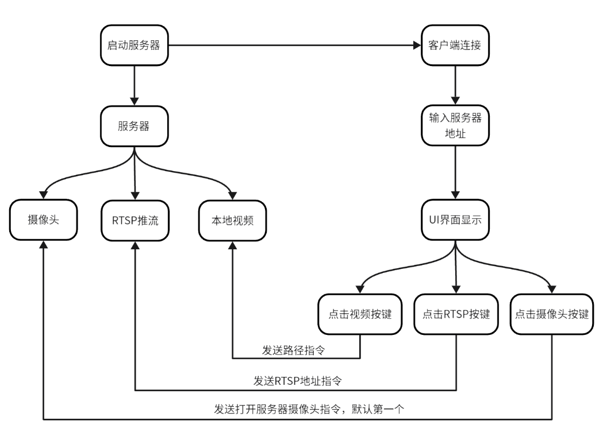

## GUI界面
---

## 系统框架

    

## 简要
- 使用了Socket通信
- 采用了YOLOv8算法框架
- 该项目为客户端做的人流量监测系统
## 使用环境
- Ubuntu 20.04
- python≥3.8
- pytorch≥1.8
## 项目功能
- ✅ 视频推理
- ✅ 摄像头推理
- ✅ RTSP 推流
## 参考
[YOLOv8-PySide6-GUI](https://github.com/Jai-wei/YOLOv8-PySide6-GUI)
